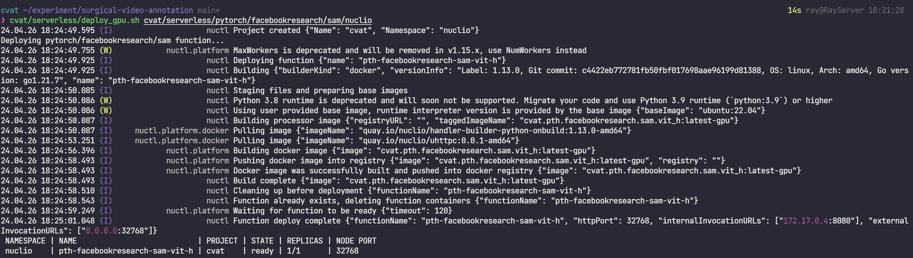
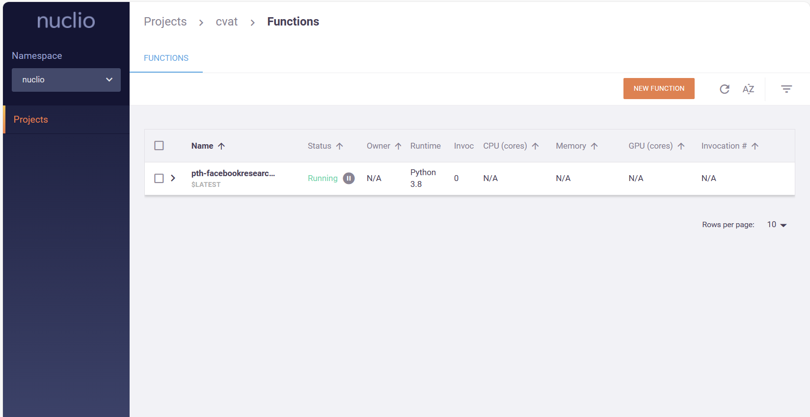

# Platform Setup for Surgical Video Annotation

*Based on cvat, segment anything, and monai-label*

`cvat version - 2.12.0`

`monailabe version - 0.8.0`

## Install docker

Before you install Docker Engine for the first time on a new host machine, you need to set up the Docker repository.
Afterward, you can install and update Docker from the repository.

### 1. Set up Docker's apt repository

```bash
# Add Docker's official GPG key:
sudo apt-get update
sudo apt-get install ca-certificates curl
sudo install -m 0755 -d /etc/apt/keyrings
sudo curl -fsSL https://download.docker.com/linux/ubuntu/gpg -o /etc/apt/keyrings/docker.asc
sudo chmod a+r /etc/apt/keyrings/docker.asc

# Add the repository to Apt sources:
# Ubuntu 22.04 LTS has been used here
echo \
  "deb [arch=$(dpkg --print-architecture) signed-by=/etc/apt/keyrings/docker.asc] https://download.docker.com/linux/ubuntu \
  $(. /etc/os-release && echo "$VERSION_CODENAME") stable" | \
  sudo tee /etc/apt/sources.list.d/docker.list > /dev/null
sudo apt-get update
```

### 2. Install the Docker packages

To install the latest version, run:

```bash
sudo apt-get install docker-ce docker-ce-cli containerd.io docker-buildx-plugin docker-compose-plugin

sudo usermod -aG docker $USER

```

## Setup conda environment

```bash
conda create -n cvat python=3.10 -y

conda activate cvat

# CUDA 12.1
conda install pytorch==2.1.2 torchvision==0.16.2 torchaudio==2.1.2 pytorch-cuda=12.1 -c pytorch -c nvidia

pip install -r ./MONAILabel/requirements-dev.txt

```

## Deploy cvat

cvat version 2.12.0

```bash
# use real-ip instead of localhost to make the CVAT projects sharable
export CVAT_HOST=127.0.0.1
export CVAT_VERSION=v2.12.0

# Start CVAT from docker-compose, make sure the IP and port are available.
docker compose -f cvat/docker-compose.yml -f cvat/components/serverless/docker-compose.serverless.yml up -d

# Create CVAT username and password
docker exec -it cvat_server bash -ic 'python3 ~/manage.py createsuperuser'

```

The setup process takes port 8070, 8080, 8090, if alternative ports are preferred, refer to [CVAT Guide](https://docs.cvat.ai/docs/administration/basics/installation/)

CVAT should be on after this step, refer to http://127.0.0.1:8080 in Chrome to open CVAT, login with the superuser username and password:

## Add serverless SAM

### 1. Install nuclio

```bash
wget https://github.com/nuclio/nuclio/releases/download/1.13.0/nuctl-1.13.0-linux-amd64 \
    -O /home/ray/Program/nuctl-1.13.0-linux-amd64

chmod +x /home/ray/Program/nuctl-1.13.0-linux-amd64

sudo ln -sf /home/ray/Program/nuctl-1.13.0-linux-amd64 /usr/local/bin/nuctl

```

However, we can not use nuctl right now.

It might report errors below:

```raw
Call stack:
stdout:
Unable to find image 'gcr.io/iguazio/alpine:3.17' locally
docker: Error response from daemon: Get "https://gcr.io/v2/": net/http: request canceled while waiting for connection (Client.Timeout exceeded while awaiting headers).
See 'docker run --help'.
```

We can do like this:

```bash
docker pull alpine:3.17

docker images | grep alpine

# docker tag eaba187917cc gcr.io/iguazio/alpine:3.17
docker tag <your alpine tag> gcr.io/iguazio/alpine:3.17

```

### 2. Deploy SAM on GPU

```bash
cvat/serverless/deploy_gpu.sh cvat/serverless/pytorch/facebookresearch/sam/nuclio

```

If you install failure and reported error like below:

```raw
Call stack:
stdout:
041f2a95e6313a28659d0e2b2aaf706aa7ee95d844c3fd6d148a503fadd5829a
docker: Error response from daemon: could not select device driver "" with capabilities: [[gpu]].
```

You should install Nvidia Container Toolkit

```bash
distribution=$(. /etc/os-release;echo $ID$VERSION_ID)
curl -s -L https://nvidia.github.io/libnvidia-container/gpgkey | sudo apt-key add -
curl -s -L https://nvidia.github.io/libnvidia-container/$distribution/libnvidia-container.list | sudo tee /etc/apt/sources.list.d/nvidia-container-toolkit.list

sudo apt-get update
sudo apt-get install -y nvidia-container-toolkit

sudo systemctl restart docker

```

Install successfuly



To check or monitor the status of deployed function container,
we can open Nuclio platform at http://127.0.0.1:8070 by default
and see whether deployed models are running.



## Active learning with MONAI Label

```bash
# Deploy all endoscopy models
./MONAILabel/plugins/cvat/deploy.sh endoscopy

# Or to deploy specific function and model, e.g., tooltracking
./MONAILabel/plugins/cvat/deploy.sh endoscopy tooltracking
```

```bash
mkdir workspace

pip install monailabel

monailabel apps --download --name endoscopy --output workspace/apps

mkdir -p workspace/datasets

wget "https://github.com/Project-MONAI/MONAILabel/releases/download/data/endoscopy_frames.zip" \
    -O workspace/datasets/endoscopy_frames.zip

unzip workspace/datasets/endoscopy_frames.zip -d workspace/datasets/endoscopy_frames

```

```bash
# cd to the folder where have the downloaded apps and data
cd workspace

export MONAI_LABEL_DATASTORE=cvat
export MONAI_LABEL_DATASTORE_URL=http://127.0.0.1:8080
# the USERNAME and PASSWARD are the authentications created with command:
# "docker exec -it cvat bash -ic 'python3 ~/manage.py createsuperuser"
export MONAI_LABEL_DATASTORE_USERNAME=<USERNAME>
export MONAI_LABEL_DATASTORE_PASSWORD=<PASSWORD>

# Specify the path of the downloaded endoscopy app (--app <APPPATH>) and the sample dataset (--studies <DATAPATH>)
monailabel start_server \
  --app apps/endoscopy \
  --studies datasets/endoscopy_frames \
  --conf models tooltracking \
  --conf epistemic_enabled true \
  --conf epistemic_top_k 2

```


---

**Todo list** 🤡

* [ ] custom serverless
* [ ] active learning with own models
* [ ] support video formats

---

**Acknowlegement**

- cvat (https://github.com/cvat-ai/cvat)
- segment-anything (https://github.com/facebookresearch/segment-anything)
- monai-label (https://github.com/Project-MONAI/MONAILabel)
- monai-tutorial (https://github.com/Project-MONAI/tutorials/blob/main/monailabel/monailabel_endoscopy_cvat_tooltracking.ipynb)
